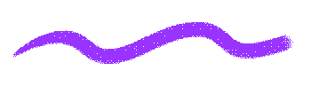
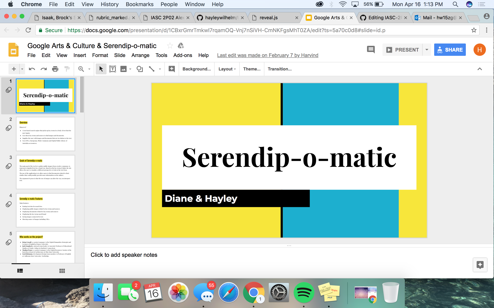

# IASC-2P02
## Hayley Wilhelm

### Bio

Hello! My name is Hayley Wilhelm and I am a current second year Interactive Arts and Science (IASC) student at Brock University. I am originally from the Cayman Islands and found myself applying to Brock U in St. Catharines late 2015. Within my 4 years at Brock, I hope to develop my graphic design knowledge as well as to better my understanding of hardware and software within a computer system. In my classes, IASC 2P02 specifically, I hope to learn more about the uses of digital technology in other professions, such as geography and literature. Through the use of tools like Voyant and Github, I plan to analyze literary texts by focusing on their geographical aspects, in addition to their key terms/subject topics. 

Within the specific field of IASC class 2P02, digital prototype, I find that my interests lean more towards media archaeology and cultural studies. Through being able to analyze past media and cultural practices, I hope to create a deeper understanding towards my work. In existing projects, such as my research presentation, I look at a past technology and reflect of its relation to Jussi Parikka's ideas on media archaeology. My portfolio demonstrates my understanding of my specialization through continual examination of past technologies and their impacts upon oscieties culturally and socially.

As for my future, I hope to use my newly developed skills within project management to become a successful graphic designer. My love of technology and art has driven me to work my hardest and achieve my greatest within and outside of my schooling. I believe that this course will allow me to see the the importance of the georgraphical components within a piece of work. I hope that, by using this, I will be able to create graphic design pieces that also relate to the clients geographical location. I hope that you enjoy my work published here!

## Feature: [Nokia N-Gage Presentation](reveal/index.html)

This project is a presentation I made examining the Nokia N-Gage. In this presentation, I analyzed the N-Gage's impact on society when released released in October 2003, in addition to the causes and effect of its downfall. This analysis is backed up by Jussi Parikka's ideas towards medie archaeology. Within my presentation, I focus on the device's aesthetic and the hardware/software design's impact on its usability and effectiveness. I also touch on the design's possible impact on the device's unfortunate downfall. My presentation is set up to be fun and interactive, as the N-Gage was, in order to grab the audience's attention. Through the presentation, I hoped to have examined the possible causes of the Nokie N-Gage's downfall, so that we may reflect on it for future innovations. 

As for my findings, the downfall of this device relied mainly on timing. Had the Nokia worked longer to better develop their device, specifically the hardware, they may have had a bertter shot against other new devices. The hardward featured many additional details, such as bluetooth and internet, which were in no relation to the devices purpose. These additional details offered the users no advantage in their everyday lives as users felt more comfortable have two separate device; a phone and a game console. With tough contenders like the Sony PSP and teh Nintendo GameBoy, the device's downsides caused it to become less popular against these. The device was first of its kind, offering users the ability to have mobile gaming in addition to having mobile phoning services. It allowed us to have an experimental playground using future technological advances. The Nokie N-Gage gave us an insight to the technology we use on an everyday basis.

250 word statement describing how research evolved over time - made these changes which you can see [here](https://github.com/hayleywilhelm/IASC-2P02/commit/7bbb65adc855a5bc284e832736645b17245a2316). ******* AT LEAST 3 LINKS PER THIS STATEMENT TO SHOW CHANGES MADE - THIS MUST ALSO BE DONE FOR COLLABORATION PART! *******

I also made these changes, which you can see [here](). *link to commit which shows the chnages made*

Visit My Presentation: [Click Here!](reveal/index.html)

## Collaborative Project: Serendip-o-matic 

For this project, I worked in collaboration with three of my fellow classmates Harvind, Diane and Khalid. Our project featured an analysis on both Serendip-o-matic and Google Arts and Culture, and their impact on allowing users the ability to examine bodies of work. We used google docs in order to work together on one presentation at the same time. This allowed us to all contribute despite our location or timezone. We edited and collected our notes for the presentation and put them on github as our central information bank. From here we were able to input our finalized information into our presentation slides. We split our group into two pairs, where each pair was responsible for covering the information on one of the websites. Myself, along with Diane, were put in charge of recording information on Serendip-o-matic. The notes that I have contributed to this presentation are the ones relating to this website along with the theoretical discussion. 

In my discoveries, I have found that Serendip-o-matic offers its users with a variety of sources that relate to the body of text, however, many times the sources do not have any relation to the inputted body of texts. This is due to their chosen 'key terms.' These key terms may or not have direct relation to the topic of choice, however, this option allows the user to adventure beyond their topic in order to find interesting new sources. Serendip-o-matic has a quick, easy and effective text analysis platform, which made the process entertaining and knowledgeable. I find that through using Serendip-o-matic within this presentation, it allowed me to expand my knowledge on the text analysis topic as well as give me new information on topics that I researched out of fun. Google Arts and Culture (Google A&C) on the other hand offered its users a easy to navigate yet complex and intriguing platform which keeps the user continually interested. Google A&C offers a multitude of features and tool options which allow you to go beyond your general understanding of a body of work. Through features such as optical zoom on paintings and artists notes, it allows the users to see the details within the work and explore the art more deeply. The significance of this piece is that it introduces two very useful websites which give their users a new perspective towards a body of work. It allows us to understand the artists/authors intentions and meaning behind their work, as we can look into detail about their history and see how their work relates to us today. 

250 statement describing how research evolved over time (collab statement)

See all these changes [here!](https://github.com/IascAtBrock/IASC-2P02-TeamPresentations/commit/edc82b62c7f8369b9a30ae40d6128812d2a1ef43)

SHA-Hash [here!](edc82b62c7f8369b9a30ae40d6128812d2a1ef43)

## Visit My Academic Blog Post: 
[A Blog About Text Analysis](blog.md)

## Visit My Research Presentation: 
[Nokia N-Gage Presentation](reveal/index.html)

